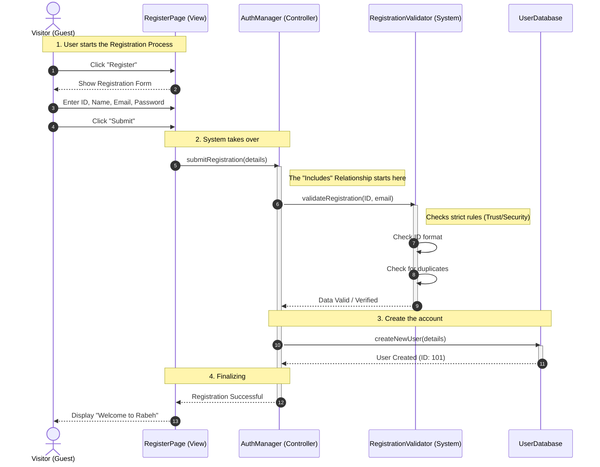

# GP

```mermaid
sequenceDiagram
    autonumber
    actor V as Visitor (Guest)
    participant UI as RegisterPage (View)
    participant C as AuthManager (Controller)
    participant S as RegistrationValidator (System)
    participant DB as UserDatabase

    Note over V, UI: 1. User starts the Registration Process

    V->>UI: Click "Register"
    UI-->>V: Show Registration Form
    V->>UI: Enter ID, Name, Email, Password
    V->>UI: Click "Submit"

    Note over UI, C: 2. System takes over

    UI->>C: submitRegistration(details)
    
    activate C
    Note right of C: The "Includes" Relationship starts here
    
    C->>S: validateRegistration(ID, email)
    activate S
    
    Note right of S: Checks strict rules (Trust/Security)
    S->>S: Check ID format
    S->>S: Check for duplicates
    S-->>C: Data Valid / Verified
    deactivate S

    Note over C, DB: 3. Create the account

    C->>DB: createNewUser(details)
    activate DB
    DB-->>C: User Created (ID: 101)
    deactivate DB

    Note over C, UI: 4. Finalizing

    C-->>UI: Registration Successful
    deactivate C
    UI-->>V: Display "Welcome to Rabeh"
```
